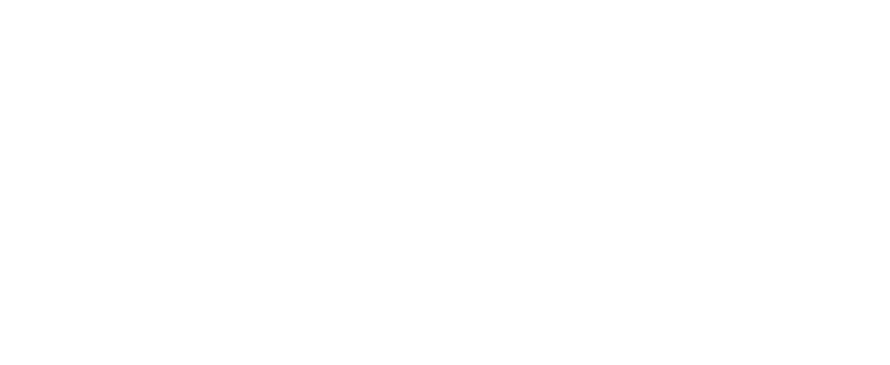

# Zenon Engine

**Zenon Engine** is an open-source C++/OpenGL toy engine for Windows that I'll be building as I learn more about Game Engine development and reinforce my Graphics Programming knowledge. This framework should not be used for any production application as the code may potentially contain bugs. *Almost* every Graphics technique used here will be based on the [Learn OpenGL Tutorial](quora.com/profile/Ashish-Kulkarni-100). 
